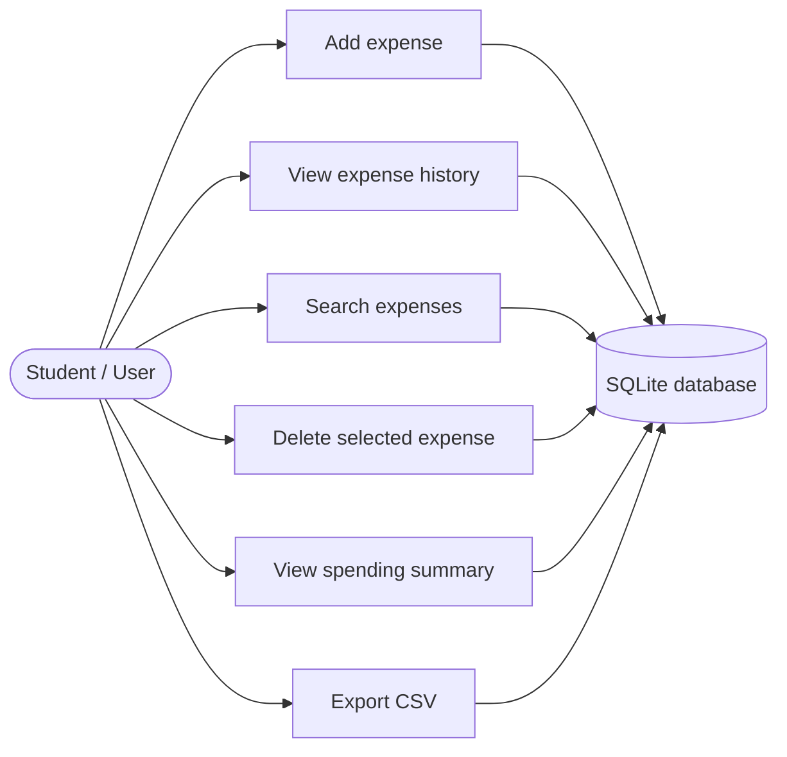
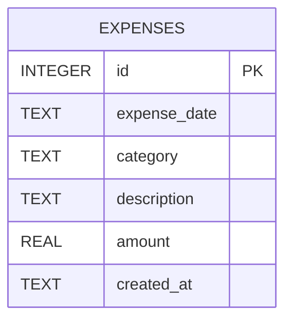

# Project Diagrams (Mermaid)

## Use-case diagram

```mermaid
flowchart LR
    U([Student / User]) --> A[Add expense]
    U --> B[View expense history]
    U --> C[Search expenses]
    U --> D[Delete selected expense]
    U --> E[View spending summary]
    U --> F[Export CSV]
    A --> DB[(SQLite database)]
    B --> DB
    C --> DB
    D --> DB
    E --> DB
    F --> DB
```

## Entity relationship diagram

```mermaid
erDiagram
    EXPENSES {
        INTEGER id PK
        TEXT expense_date
        TEXT category
        TEXT description
        REAL amount
        TEXT created_at
    }
```

## Flowchart
See `FLOWCHART.mmd` for the full editable Mermaid flowchart source.
